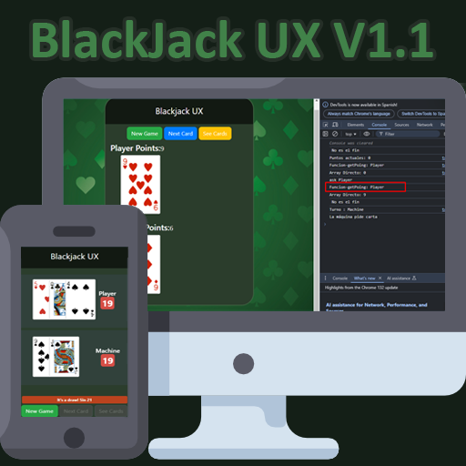

### 📌 Cambios recientes:
- Ahora la maquina toma mejores desiciones en su turno
- Se corrigieron errores en la lógica de turnos.
- Se paso el Js vanilla creando Modulos de vite

DEMO Online: https://maestroyaco.github.io/js-blackjack-ux/ Thanks Git Page

# 🚀 Unete al proyecto
Si te gusta aprender y compartir con otros tus logros y avances, subate a js-BlackJack-Ux 
Aprende sobre modulos en vite usando javaScript, sobre ciclos y manejar el doom.

* Comparte mejoras del codigo
* Mejora la logica de los turnos
* Haz de la maquina un gran contrincante
* Sumate aprender sobre git, github y su control de versiones.

🔹 Lo mas importante es querer, aprender, crear y enseñar. Esa es mi filosofia al programar. 

Sobre este proyecto, lo que se busca es tomar un simple codigo, y mejorarlo hasta convertirlo en una web-app funcional para divertirte con amigos, ofreciendo una experiencia de BlackJack online en donde el Ui y el UX buscan mejorarse constantemente.

El objetivo final de este proyecto es que sea multijugador con un sistema de ranking integrado y ofrecer skin por puntos ganados a los jugadores. 

## Para iniciar el proyecto
1. Clone el repositorio a visual estudio code (Recomendado el editor)
2. Asegurece de tener node instalado, abra una terminal y ejecute ```npm install``` Para bajar las dependencias necesarias
3. Inicie el ```npm run dev``` para visualizar el proyecto localmente en el link que te entrega la terminal
4. Cuango haga cambios contacteme para hacer un commit en este repositorio principal

😃 Mi discord es: maestroyaco  ID: 333080333429768202
